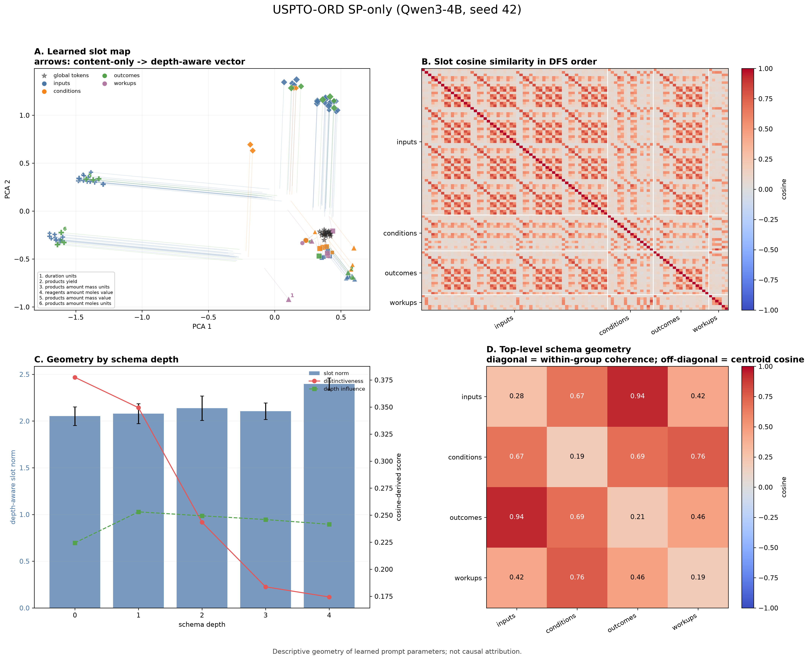
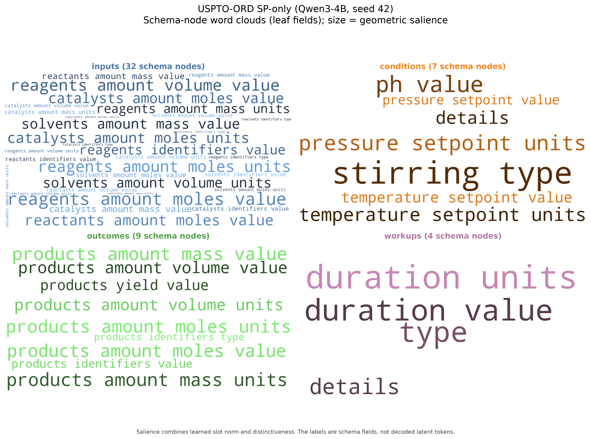

# Soft-prompt interpretability

This repository includes a backbone-free analysis of learned hierarchical
soft-prompt parameters. The analysis uses only a local `soft_prompt.pt` and the
public USPTO-ORD schema; it does not load the language-model backbone or
training examples.

## Example from the paper configuration

The example below was generated from the paper's USPTO-ORD soft-prompt-only
configuration (Qwen3-4B, hierarchical prompt, seed 42, 20 global tokens, and
two tokens per schema node). The checkpoint and model weights are not
distributed in this repository.



The learned geometry shows modest top-level schema organization: mean
within-subtree cosine similarity is 0.2664, compared with 0.2019 between
subtrees, for a margin of +0.0644. Mean depth influence, measured as one minus
the cosine between content-only and depth-aware slot vectors, is 0.2453.
Global-token affinity is near zero on average (0.0054), while the two learned
tokens within each schema slot have mean cosine similarity 0.4387.

The companion field-name clouds provide a qualitative index of geometrically
prominent leaf slots:



Word size is based on a transparent geometric salience heuristic: the square
root of percentile slot norm multiplied by percentile distinctiveness.
Labels are public schema field names, not decoded latent tokens.

These visualizations describe parameter geometry. They are not gradient
attribution, feature importance, causal evidence, or a natural-language
decoding of the learned prompt.

## Generate an atlas

Install the optional visualization dependencies:

```bash
python -m pip install -e ".[interpretability]"
```

Run the analysis on a locally trained hierarchical checkpoint:

```bash
python scripts/analyze_prompt_atlas.py \
  --checkpoint outputs/checkpoints/sp_uspto_seed42_best \
  --output-dir outputs/interpretability/uspto_prompt_atlas \
  --title "USPTO-ORD SP-only (Qwen3-4B, seed 42)"
```

The checkpoint argument may point either to a directory containing
`soft_prompt.pt` or directly to that file. The command writes:

- `prompt_atlas.png` and `prompt_atlas.pdf`;
- `prompt_wordclouds.png` and `prompt_wordclouds.pdf`;
- `prompt_key_metrics.csv`;
- `prompt_summary.json` and `prompt_summary.md`.

All generated files are placed under the requested output directory. The
repository ignores `outputs/`, checkpoints, tabular exports, and model-weight
formats by default.
